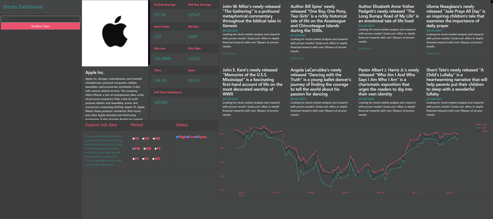

# Stocks Dashboard

## Dependencies

`pip install -r requirements.txt`

## Usage

To run this dashboard locally, you will need a finnhub api key. You can get one [here](https://finnhub.io/register).

Then put that key in a file called `finnhubkey.txt` in the working directory and run the app:

`python dashboardv2.py`

